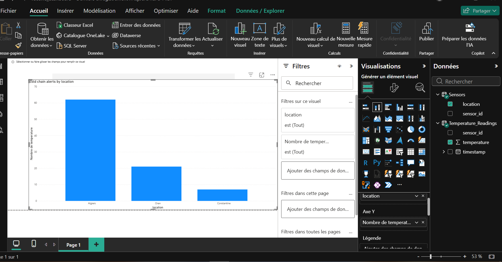

# # Vaccine Cold Chain Data Pipeline

##  Problem
Vaccines must be kept within a safe temperature range during transport and storage.  
Temperature violations can lead to product loss and serious health risks.

Organizations need automated systems to monitor sensor data, detect anomalies, and provide clear insights for decision making.

---

##  Solution
This project simulates an end-to-end data pipeline for vaccine cold-chain monitoring.

The pipeline:

- Generates synthetic temperature sensor data using Python
- Performs data quality checks and alert detection
- Loads data automatically into SQL Server
- Analyzes temperature alerts using SQL
- Visualizes monitoring results with Power BI dashboards

---

## 🧱 Architecture

---

## 📊 Dashboard Preview

---

##  Features
- Automated data ingestion (Python → SQL Server)
- Data quality validation
- Temperature alert detection
- SQL analytics queries
- Monitoring dashboard (Power BI)

---

##  Tech Stack
- Python
- SQL Server
- Power BI
- pyodbc

---

## 📂 Project Structure
